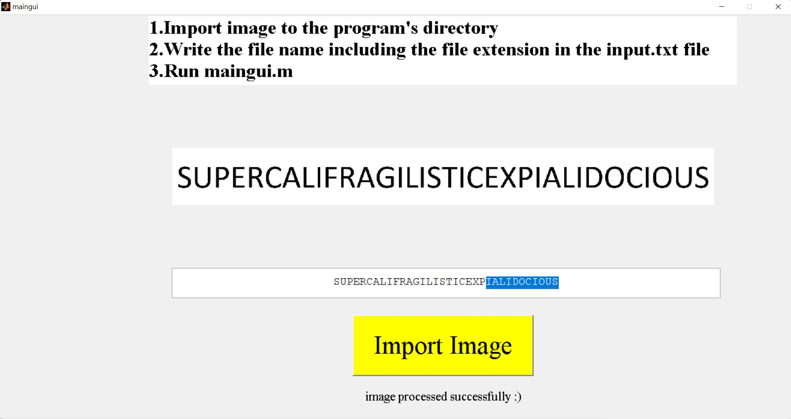

# Image-To-Text-App

## Project Description
A program to detect character in pictures through scanning pixel by pixel and finding the character of highest percentage similarity using a pre-existing library of characters.

## Instructions
1. Download all files into one Directory.

2. Use a given test or import your own test image into the directory. Type the name of the test image in the input.txt.

3. Run maingui.fig.Press import image and let the magic begin :)

4. A copyable/selectable version of the text is generated.

## Extras
You will also find MATLAB presentation powerpoint explaining the code parts of the project if you are interested to know how it works.
